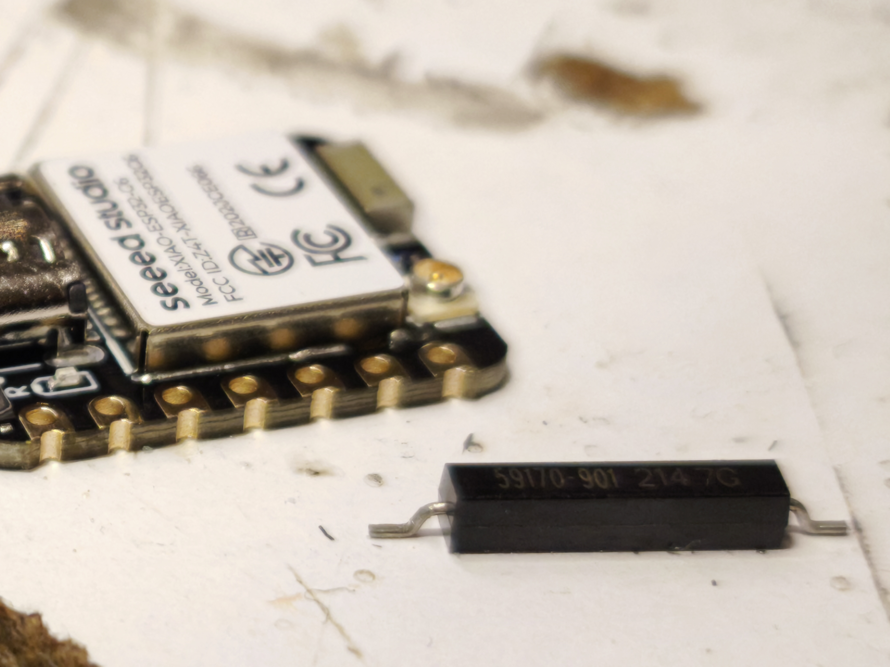
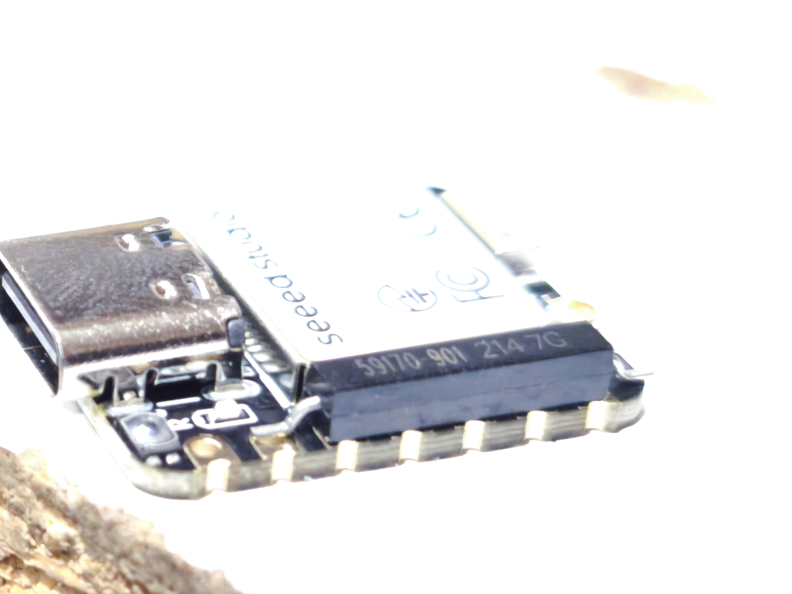
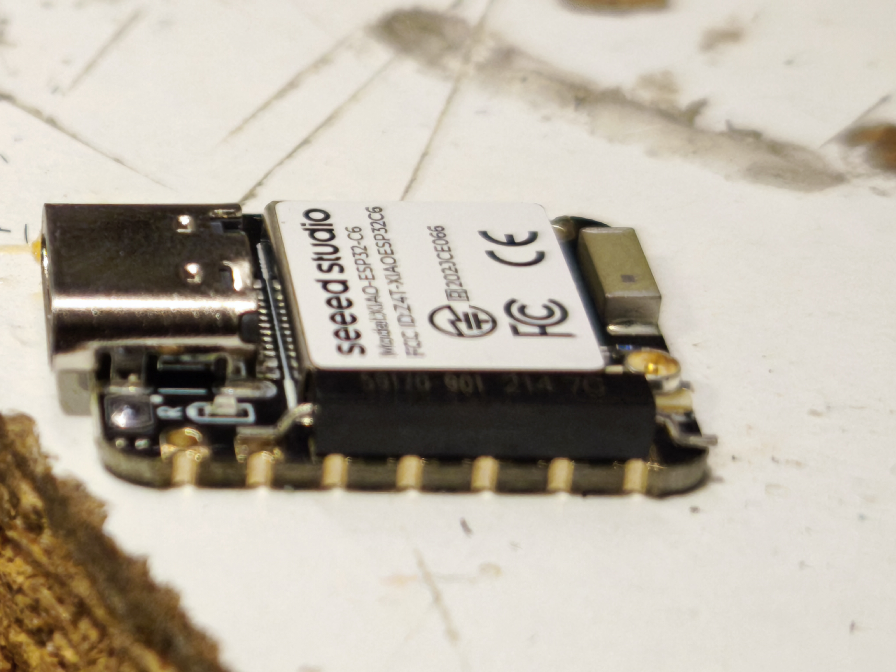
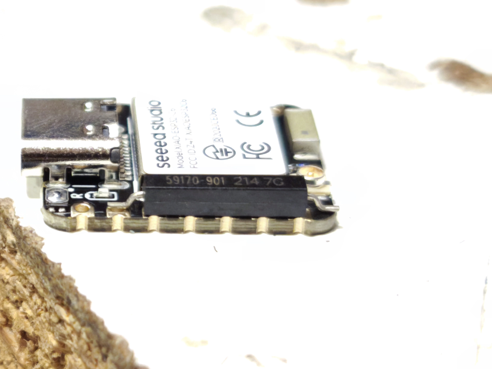

# DIY Zigbee Door/Window Sensor (ESP32-C6)

 <!-- Optional banner image to showcase the build -->

A low-power, deeply customizable Zigbee Contact Sensor built using the ESP32-C6 microcontroller. This project integrates seamlessly with Home Assistant via Zigbee2MQTT (Z2M) or ZHA, reporting instantaneous open/close states alongside accurate battery percentage through periodic deep sleep wakeups.

## Features

- **Instant Reporting:** Wakes up via external interrupt (Reed Switch) to instantly report door/window state.
- **Deep Sleep Optimization:** Only wakes up when necessary or during the predefined timer interval to keep battery consumption low. No continuous power draw.
- **Battery Monitoring:** Accurate ADC-based battery voltage reading and reporting, with customizable sleep intervals so that Home Assistant is reliably updated even if the door is rarely used.
- **RTC Timer Tracking:** Features an intelligent sleep timer using RTC memory that doesn't reset when the door opens, ensuring consistent interval reporting.
- **Xiao ESP32-C6 Compatibility:** Compact and ideal for small custom cases (though any ESP32-C6 chip can be utilized).
- **Zigbee Direct Integration:** Native Zigbee functionality without the need for Wi-Fi.

---

## Hardware Requirements

To build this yourself, you will need the following components:

| Item | Links / Details |
|------|-------|
| **1x ESP32-C6 Microcontroller** | [Seeed Studio XIAO ESP32C6](https://www.seeedstudio.com/Seeed-Studio-XIAO-ESP32C6-p-5884.html) (Recommended for its tiny footprint, but any ESP32-C6 will work) |
| **1x Reed Switch (Magnetic Contact)** | [AliExpress Link](https://ar.aliexpress.com/item/1005009026540033.html) |
| **1x LiPo Battery** | Choose a size that perfectly fits your 3D printed enclosure (e.g., 3.7V 300mAh or similar) |
| **1x Neodymium Magnet** | `20 x 10 x 1.5 mm` (Or any dimension depending on your setup and distance requirements) |
| **Miscellaneous (Optional)** | 1MΩ Resistors + 100nF Capacitor (For the battery voltage divider circuit), Wires, Soldering Iron. |

---

## 3D Printed Enclosure

You can use the case from my previous Smart Button project for this sensor! Just print the case without the button part. It fits the Xiao ESP32-C6 and a compact LiPo battery perfectly.
- **Download 3D Print Files here:** [Xiao_ESP32C6_Zigbee_Project / 3dPrintFiles](https://github.com/aGGreSSiv/Xiao_ESP32C6_Zigbee_Project/tree/master/3_Smart_Button_Battery_WithSleep/3dPrintFiles)

---

## Assembly Gallery

Here are some photos of the assembly process and the final compact build.

  
   

  
  

---

## Software Setup (Arduino IDE)

1. **Board Manager:** Make sure you have the standard `esp32` Arduino core (v3.0.0+) installed in your Arduino IDE Board Manager.
2. **Select Board:** Choose `XIAO_ESP32C6` (or your generic C6 board).
3. **Menu Settings:**
    - **Zigbee Mode:** `Zigbee End Device (ZED)`
    - **Erase All Flash Before Sketch Upload:** `Disabled` (unless you want to factory reset pairing)
4. Upload `Xiao_ESP32C6_Zigbee_Door_Window_Sensor.ino`.

### Connecting to Home Assistant

- Upon flashing and powering up for the first time, the device will automatically enter pairing mode for 30 seconds.
- Turn on "Permit Join" in Z2M or your Zigbee Coordinator.
- Wait for the device to appear as a "Contact Sensor" (Manufacturer: Espressif, Model: ZBSensor2).
- You may need to press the reset button while the sensor is near the coordinator to ensure the IAS Zone interview completes successfully.

---

## Customization

You can tweak the following definitions within the code:
- `#define TIME_TO_SLEEP 3600`: The interval in seconds the device wakes up to send a "Heartbeat" battery report. (Default: 1 Hour).
- `float calibration_factor = 1.0145;`: Adjust this constant to match your multimeter reading for pin-point accurate battery reporting.

## License
MIT License. Feel free to fork, build, and adapt it to your own generic ESP32-C6 breakout boards!
